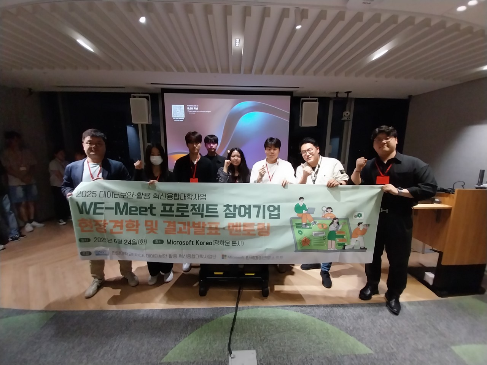
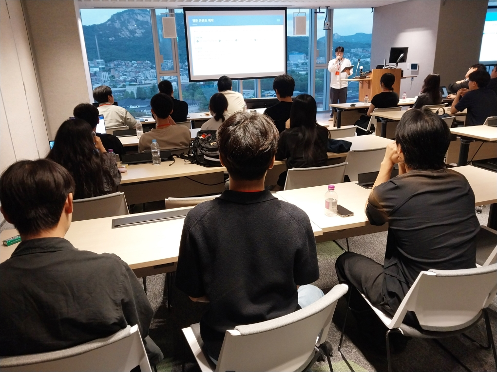
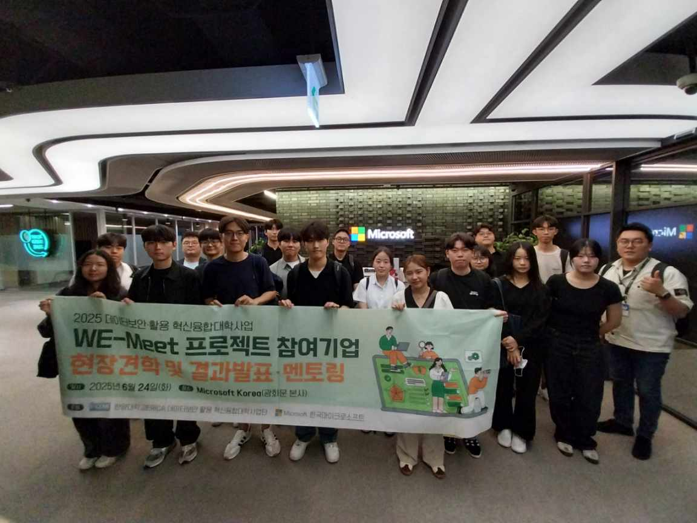

# CL-WeMeet  
**WeMeet 스타일 실시간 협업 웹 플랫폼**


> **실시간 채팅 · Azure 클라우드 퀴즈 · 웹툰 추천 · 팀 소개**  
> 귀여움 + 기능성 다 잡은 2025 종합설계 최고의 작품!

<br>

## 프로젝트 미리 보기

| 메인 화면 & 전체 분위기 |
|-------------------------|
|  |

<br>

| 우리 팀의 따뜻한 순간들 |
|-------------------------|
|      |

<br>

## 핵심 기능

| 기능 | 설명 | 실제 화면 |
|------|-------|------------|
| **실시간 채팅** | Node.js + Express 기반 실시간 채팅 시스템 |  |
| **Azure 클라우드 퀴즈** | 60문항 JSON 기반 랜덤 출제<br>실시간 정답 확인 + 점수 표시 | ( ) | 
| **퀴즈 인사이트** | 자주 틀리는 문제·자주 맞는 문제를 시각적으로 제공 |  |
| **웹툰 기능** | AI 기반 웹툰 자동 생성·추천 기능 제공 |   |
| **완전 반응형 디자인** | 모바일 · 태블릿 · 데스크톱 모두 최적화 | 모든 페이지에서 적용 |

<br>


## 기술 스택

| 분야         | 사용 기술                                      |
|--------------|------------------------------------------------|
| Frontend     | HTML5 · CSS3 · Vanilla JavaScript              |
| Backend      | Node.js · Express.js                           |
| Server       | `server.js` (포트 3000)                        |
| 데이터       | JSON (`questions.json` – 총 60문항)            |
| 디자인       | Cloud Corporation 스타일 귀여운 일러스트       |

<br>

## 프로젝트 구조

```plaintext
cl-wemeet-project/
├── assets/           팀 순간 사진
├── css/              style.css
├── data/             questions.json (Azure 퀴즈 60문제)
├── images/           메인 배경, 버튼
├── img/              퀴즈, 웹툰, 채팅, 만화 이미지
├── js/               main.js, quiz.js
├── media/            Demo_Video.gif
├── server.js         실시간 채팅 서버
└── *.html            메인, 퀴즈, 웹툰, 인사이트 등